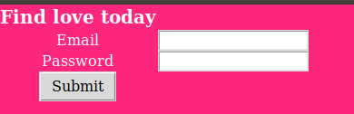

# Tinder_Bot

## What ? 
Quick project I did for fun. Its a bot that login in tinder and like everybody automatically. I used [Selenium](https://pypi.org/project/selenium/) for the automation process.
I also made a small GUI with [Tkinter](https://docs.python.org/fr/3/library/tkinter.html)

## Layout 

